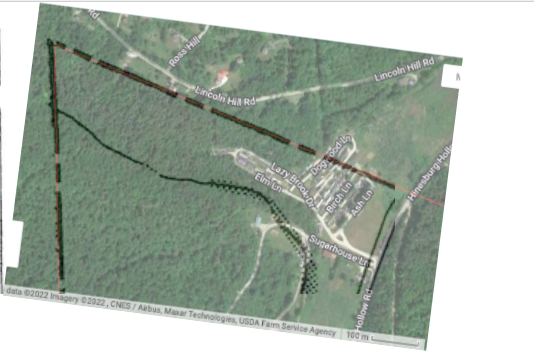
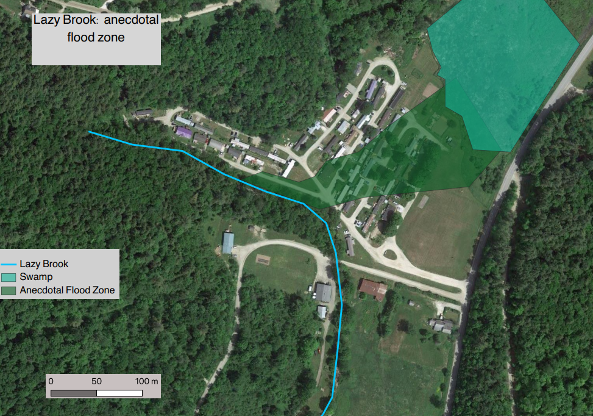

In order to analyze the flood risk to residents of the Lazy Brook mobile home park in Starksboro, VT, I needed to geocode the FEMA flood zone firmette for northern Starksboro.
To do this, I learned how to georefrence a TIFF in QGIS.

Here is the FEMA Firmette for Northern Starksboro overlaid with the corresponding satelite image.

Confirmed by a site visit, the course of the brook does not match up with FEMA projections.
The brook and floodzone have shifted since FEMA originally mapped this area in 1985.

Here is the actual floodzone, as determined by resident's memories of past flooding events.
