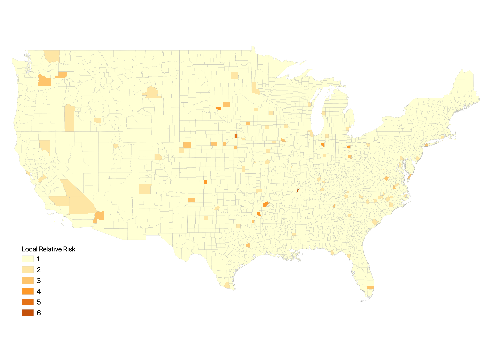

cluster has rel risk score for each cluster, orig. did risk score for center of the cluster applied to the whole cluster, could still be better by avg the risk score or taking the highest risk score in the cluster,

wow the relationships are not strong

